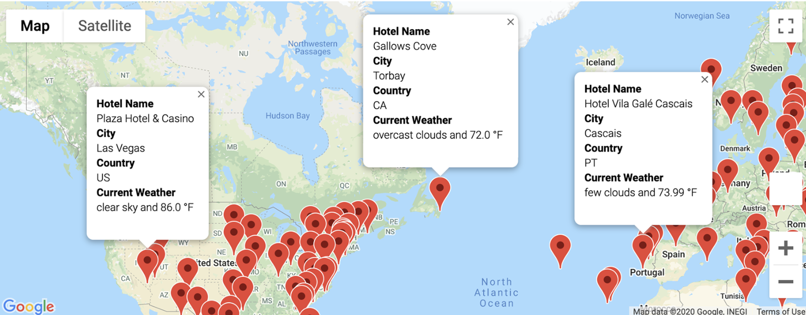
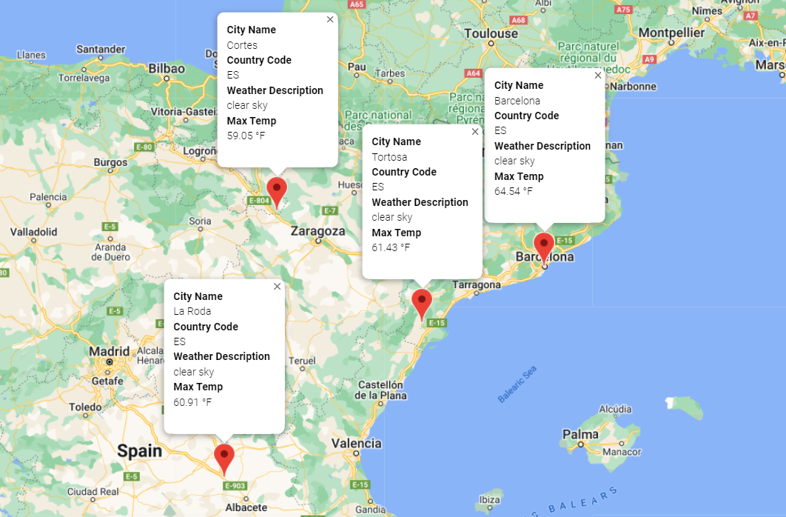

# Vacation Itinerary App with Python and APIs

    

## 
Build a Travel Itinerary Generator using Python and APIs

<a href="#goals">Goals</a> &nbsp;&bull;&nbsp;
<a href="#dataset">Dataset</a> &nbsp;&bull;&nbsp;
<a href="#tools-used">Tools Used</a>

# 
Goals

- Collect and analyze weather data across cities worldwide. PlanMyTrip will use the data to recommend ideal hotels based on clients' weather preferences. 

- Create a Pandas DataFrame with 500 or more of the world's unique cities and their weather data in real time. This process will entail collecting, analyzing, and visualizing the data. 

    

- From the list of potential travel destinations, the beta tester will choose four cities to create a travel itinerary. Finally, using the Google Maps Directions API, we will create a travel route between the four cities as well as a marker layer map.

    

# 
Dataset

We will utilize the Openweathermaps API to retrieve weather data from 500-700 randomly generated geographic coordinates. This data will be saved in a CSV file.

- [Weather Database:](Weather_Database/WeatherPy_Database.csv) Weather data for 693 geographic coordinates, in CSV format

# 
Tools Used

- **Python:** Programming language used to build automated auditing solution
    - **Pandas:** Open source Python library providing high performance analysis tools
    - **Matplotlib:** Open source Python library used for graphing and plotting
    - **Numpy:** Open source Python library used for advanced scientific computing
- **Openweathermap API:** API access to Openweather map data
- **Google Maps API:** API access to Google Maps visualization
- **Jupyter Notebook:** Open source web based application used to run our python code

[Back to top](#vacation-itinerary-app-with-python-and-apis)